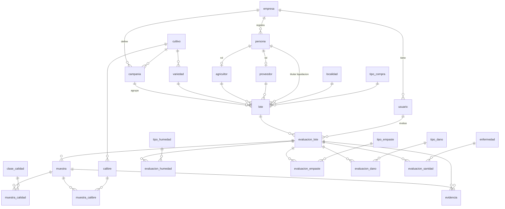

# Modelo de datos – 01. Identificación y Calidad del Lote (Ajo)

> Fuente: `N°1 EVALUACION CAMPO AJO 2025.xlsx`, hoja **LOTE #XXX MODELO - VARIEDAD - C**, puntos **1. Identificación lote** y **2. Calidad lote**.
> Motor: PostgreSQL ≥ 13. Estado: **v1**, DDL en `database/init/`.

---

## 1. Decisiones de diseño

| Tema | Decisión |
|---|---|
| Enfoque | **Híbrido**: una tabla por objeto. Los catálogos son configurables por empresa y hay una tabla de resultados por cada factor. Agregar opciones solo requiere insertar filas; agregar un factor nuevo requiere una migración. |
| Multi-empresa | `empresa_id` en todas las tablas de negocio desde el inicio. La seguridad a nivel de fila (**RLS**) se activa cuando llegue el segundo cliente. |
| Multi-cultivo | Los catálogos tienen `cultivo_id` (hoy solo AJO), para poder abrir el sistema a otros productos sin rediseñar. |
| Claves | `id uuid DEFAULT gen_random_uuid()`. Permite capturar evaluaciones en campo sin conexión y sincronizarlas después. |
| Auditoría | Todas las tablas tienen `created_at timestamptz`, `created_by uuid`, `updated_at timestamptz` y `updated_by uuid`. |
| Porcentajes | Se guardan como `numeric(5,2)` de 0 a 100 (en el Excel, 0.80 se guarda como 80.00). |
| Promedios (PROM) | **No se guardan**. Se calculan en vistas. |
| Nivel de humedad | Tipo `ENUM nivel_enum ('BAJA','MEDIA','ALTA')`. La columna "stand by" queda para una versión futura. |

### Estructura común de los catálogos
Todas las tablas de catálogo comparten estas columnas:

| Columna | Tipo | Nulo | Descripción |
|---|---|---|---|
| id | uuid | NO | PK |
| empresa_id | uuid | NO | FK → empresa |
| cultivo_id | uuid | NO | FK → cultivo |
| codigo | varchar(30) | NO | Código corto; `UNIQUE(empresa_id, cultivo_id, codigo)` |
| nombre | varchar(120) | NO | Texto que se muestra al usuario |
| orden | smallint | NO | Orden en pantalla |
| activo | boolean | NO | Baja lógica (default `true`) |

---

## 2. Diagrama ER

---

## 3. Diccionario de datos

### 3.A Base / SaaS

**empresa**: la empresa cliente del sistema (tenant).
| Columna | Tipo | Nulo | Descripción |
|---|---|---|---|
| id | uuid | NO | PK |
| ruc | varchar(11) | NO | UNIQUE |
| razon_social | varchar(200) | NO | |
| nombre_comercial | varchar(200) | SÍ | |
| activo | boolean | NO | |

**usuario**: el evaluador y el resto de usuarios.
| Columna | Tipo | Nulo | Descripción |
|---|---|---|---|
| id | uuid | NO | PK |
| empresa_id | uuid | NO | FK |
| nombres | varchar(150) | NO | |
| dni | varchar(15) | SÍ | |
| email | varchar(150) | NO | UNIQUE |
| rol | varchar(30) | NO | EVALUADOR, ADMIN, … |
| activo | boolean | NO | |

**cultivo**: catálogo global (AJO).
| Columna | Tipo | Nulo | Descripción |
|---|---|---|---|
| id | uuid | NO | PK |
| codigo | varchar(20) | NO | UNIQUE (`AJO`) |
| nombre | varchar(80) | NO | |

### 3.B Maestros (Punto 1)

**persona**: datos de identidad, compartidos por agricultores, proveedores y titulares de la liquidación.
| Columna | Tipo | Nulo | Descripción |
|---|---|---|---|
| id | uuid | NO | PK |
| empresa_id | uuid | NO | FK |
| tipo_documento | varchar(10) | NO | DNI, RUC, CE |
| numero_documento | varchar(20) | NO | `UNIQUE(empresa_id, tipo_documento, numero_documento)` |
| nombres | varchar(200) | NO | Nombre completo o razón social |
| telefono | varchar(20) | SÍ | |

**agricultor** y **proveedor**: cada una es una tabla de rol con relación 1 a 1 con `persona`.
| Columna | Tipo | Nulo | Descripción |
|---|---|---|---|
| id | uuid | NO | PK |
| empresa_id | uuid | NO | FK |
| persona_id | uuid | NO | FK → persona, UNIQUE |
| activo | boolean | NO | |

> El **proveedor** es el intermediario o acopiador (por ejemplo, Neiver Lazarte). Una misma persona puede ser agricultor y proveedor a la vez.

**localidad**: la columna CIUDAD / CCPP del Excel.
| Columna | Tipo | Nulo | Descripción |
|---|---|---|---|
| id | uuid | NO | PK |
| empresa_id | uuid | NO | FK |
| nombre | varchar(120) | NO | EL PEDREGAL |
| tipo | varchar(10) | NO | CIUDAD / CCPP |
| ubigeo | char(6) | SÍ | Código INEI (opcional) |

**campania**: campaña o temporada.
| Columna | Tipo | Nulo | Descripción |
|---|---|---|---|
| id | uuid | NO | PK |
| empresa_id | uuid | NO | FK |
| cultivo_id | uuid | NO | FK |
| codigo | varchar(20) | NO | `2025` |
| fecha_inicio / fecha_fin | date | SÍ | |
| activa | boolean | NO | |

**variedad** y **tipo_compra**: usan la estructura común de catálogo.

### 3.C Catálogos de calidad (Punto 2)

| Tabla | Columnas adicionales a la estructura común |
|---|---|
| **clase_calidad** | — |
| **calibre** | `diametro_min_mm numeric(5,1)`, `diametro_max_mm numeric(5,1) NULL` (NULL = sin límite superior, por ejemplo >70) |
| **tipo_humedad** | — |
| **tipo_empaste** | — |
| **tipo_dano** | `es_excluyente boolean` (para "NO CONTIENE": si se marca, no se puede marcar otro daño) |
| **enfermedad** | `nombre_cientifico varchar(150) NULL`, `se_transmite_por_semilla boolean`, `evaluar_en_campo boolean` (si es `true`, aparece en el formulario como SI/NO + %) |

### 3.D Transaccionales

**lote**: Punto 1, identificación del lote.
| Columna | Tipo | Nulo | Descripción |
|---|---|---|---|
| id | uuid | NO | PK |
| empresa_id | uuid | NO | FK |
| campania_id | uuid | NO | FK |
| cultivo_id | uuid | NO | FK |
| codigo | varchar(30) | NO | `LOTE 004`; `UNIQUE(empresa_id, campania_id, codigo)` |
| variedad_id | uuid | NO | FK → variedad |
| agricultor_id | uuid | NO | FK → agricultor |
| proveedor_id | uuid | SÍ | FK → proveedor |
| titular_liquidacion_id | uuid | SÍ | FK → persona. Es el **DNI LC**: la persona a cuyo nombre se emite la liquidación de compra |
| localidad_id | uuid | NO | FK → localidad |
| zona | varchar(50) | NO | Texto libre, por ejemplo `B3 P52` |
| zona_normalizada | varchar(50) | NO | Columna generada: `upper(regexp_replace(trim(zona),'\s+',' ','g'))` |
| latitud / longitud | numeric(9,6) | SÍ | Ubicación (MAPS) |
| maps_url | text | SÍ | Enlace de Google Maps |
| tipo_compra_id | uuid | NO | FK. **Lo decide el evaluador** |
| fecha_arrancado | date | SÍ | |
| fecha_corte | date | SÍ | |
| fecha_carga | date | SÍ | |
| estado | varchar(15) | NO | ACTIVO / ANULADO / (futuros: COMPRADO, …) |

> **Antiduplicados:** `CREATE UNIQUE INDEX ux_lote_zona ON lote(empresa_id, campania_id, zona_normalizada) WHERE estado <> 'ANULADO';`

**evaluacion_lote**: Punto 2. Un lote puede tener varias evaluaciones (re-evaluaciones).
| Columna | Tipo | Nulo | Descripción |
|---|---|---|---|
| id | uuid | NO | PK |
| empresa_id | uuid | NO | FK |
| lote_id | uuid | NO | FK → lote |
| evaluador_id | uuid | NO | FK → usuario |
| fecha_evaluacion | date | NO | |
| observacion | text | SÍ | La celda OBS (recomendaciones de carga) |
| estado | varchar(15) | NO | BORRADOR / CERRADA |

**muestra**: muestra representativa (1..N; hoy se toman 3).
| Columna | Tipo | Nulo | Descripción |
|---|---|---|---|
| id | uuid | NO | PK |
| evaluacion_id | uuid | NO | FK |
| numero | smallint | NO | `UNIQUE(evaluacion_id, numero)` |
| observacion | text | SÍ | |

**muestra_calidad**: 2.1 Factor de calidad global.
| Columna | Tipo | Nulo | Descripción |
|---|---|---|---|
| muestra_id | uuid | NO | PK, FK |
| clase_calidad_id | uuid | NO | PK, FK |
| porcentaje | numeric(5,2) | NO | `CHECK (porcentaje BETWEEN 0 AND 100)` |

**muestra_calibre**: 2.2 Factor de tamaño. Tiene la misma estructura, pero con `calibre_id`. **No se exige que la suma sea 100%** (pendiente de confirmar).

**evaluacion_humedad**: 2.2.1 Humedad (se registra por evaluación).
| Columna | Tipo | Nulo | Descripción |
|---|---|---|---|
| evaluacion_id | uuid | NO | PK, FK |
| tipo_humedad_id | uuid | NO | PK, FK |
| nivel | nivel_enum | NO | BAJA / MEDIA / ALTA |

**evaluacion_empaste**: 2.2.2 Empaste, selección múltiple. PK(`evaluacion_id`, `tipo_empaste_id`).

**evaluacion_dano**: daños no visibles, selección múltiple. PK(`evaluacion_id`, `tipo_dano_id`).

**evaluacion_sanidad**: 2.2.4 Raíz rosada y 2.2.5 Fusarium (y cualquier enfermedad con `evaluar_en_campo`).
| Columna | Tipo | Nulo | Descripción |
|---|---|---|---|
| evaluacion_id | uuid | NO | PK, FK |
| enfermedad_id | uuid | NO | PK, FK |
| presente | boolean | NO | SI/NO |
| porcentaje | numeric(5,2) | SÍ | `CHECK (presente OR porcentaje IS NULL)`: solo se llena si la respuesta es SI |

**evidencia**: fotos (por muestra y generales).
| Columna | Tipo | Nulo | Descripción |
|---|---|---|---|
| id | uuid | NO | PK |
| empresa_id | uuid | NO | FK |
| evaluacion_id | uuid | NO | FK |
| muestra_id | uuid | SÍ | FK. NULL = evidencia general |
| factor | varchar(20) | SÍ | CALIDAD, CALIBRE, HUMEDAD, EMPASTE, DANO, SANIDAD |
| url_archivo | text | NO | Ruta en el almacenamiento (S3 o similar) |
| descripcion | varchar(250) | SÍ | |
| fecha_captura | timestamptz | SÍ | |

### 3.E Vistas
- **v_evaluacion_calidad_prom**: `evaluacion_id, clase_calidad_id, AVG(porcentaje)`, uniendo `muestra_calidad` con `muestra`.
- **v_evaluacion_calibre_prom**: el mismo cálculo sobre `muestra_calibre`.

---

## 4. Reglas de negocio
1. En `muestra_calidad`, cada muestra suma 100% (ABIERTOS = 100 − PRIMERA).
2. En `muestra_calibre` no se exige que la suma sea 100% (por ahora).
3. `tipo_dano.es_excluyente`: si se marca, no se puede marcar ningún otro daño en la evaluación.
4. En `evaluacion_sanidad`, el porcentaje solo se registra si `presente = true`.
5. No puede haber dos lotes activos con la misma zona en la misma campaña.
6. Solo se puede editar una evaluación mientras está en estado `BORRADOR`.

Las reglas 1, 3 y 6 se validan en la aplicación; más adelante se pueden llevar a triggers. Las reglas 4 y 5 las garantiza la base de datos (CHECK e índice único).

---

## 5. Datos semilla (tomados del Excel)

| Catálogo | Valores |
|---|---|
| cultivo | AJO |
| campania | 2025 |
| variedad | CHINO BLANCO, CHINO MORADO, NAPURI, BARRANQUINO |
| tipo_compra | PRIMERA 5 ARRIBA, PRIMERA 45/50 50/55, SEGUNDA ESCOGIDO, ABIERTOS |
| clase_calidad | PRIMERA, ABIERTOS |
| calibre | 45/50 (45–50), 50/55 (50–55), 55/60 (55–60), 60/65 (60–65), 65/70 (65–70), >70 (70–NULL) |
| tipo_humedad | GOTAS DENTRO, COLOR DIENTE MORADO, AGUA APLASTADO DE RAIZ, COLOR DIENTE ROSA BEIGE |
| tipo_empaste | BAJO, MEDIO, BUENO, MANDARINA |
| tipo_dano | PARALISIS CEROSA (Caramelo), PARALISIS ACUOSA (Daño diente), NO CONTIENE (`es_excluyente`) |
| enfermedad (`evaluar_en_campo`) | RAIZ ROSADA, FUSARIUM (se transmite por semilla) |
| enfermedad (solo referencia) | Pudrición blanca (*Sclerotium cepivorum*, se transmite por semilla), Mildiu velloso, Pudrición del cuello (*Botrytis*), Podredumbre (*Penicillium/Mucor/Rhizopus*), Mancha por *Embellisia allii*, Óxido (*Puccinia allii*), Nematodo del tallo y bulbo (*Ditylenchus dipsaci*), Gusanos de alambre, Ácaros del bulbo, Penicillium |

---

## 6. Recorrido del Excel → modelo

| Celda / sección del Excel | Destino |
|---|---|
| EVALUADOR | `evaluacion_lote.evaluador_id` |
| FECHA EVALUACION | `evaluacion_lote.fecha_evaluacion` |
| FECHA ARRANCADO / CORTE / CARGA | `lote.fecha_*` |
| UBICACION (MAPS) | `lote.latitud`, `lote.longitud`, `lote.maps_url` |
| CIUDAD / CCPP | `lote.localidad_id` |
| ZONA (validación) | `lote.zona` + índice único |
| VARIEDAD | `lote.variedad_id` |
| TIPO COMPRA | `lote.tipo_compra_id` |
| AGRICULTOR / DNI | `lote.agricultor_id` → persona |
| PROVEEDOR | `lote.proveedor_id` → persona |
| DNI LC | `lote.titular_liquidacion_id` → persona |
| 2.1 PRIMERA / ABIERTOS × N° muestra | `muestra_calidad` |
| 2.2 Calibres × N° muestra | `muestra_calibre` |
| PROM | vistas `v_*_prom` |
| 2.2.1 Humedad (tipo + valor) | `evaluacion_humedad` |
| OBS | `evaluacion_lote.observacion` |
| Evidencias fotográficas (por muestra) | `evidencia` |
| 2.2.2 Empaste (selección múltiple) | `evaluacion_empaste` |
| Daños no visibles (selección múltiple) | `evaluacion_dano` |
| 2.2.4 Raíz rosada SI/NO + % | `evaluacion_sanidad` |
| 2.2.5 Fusarium SI/NO + % | `evaluacion_sanidad` |

---

## 7. Pendientes
- [ ] Confirmar que el duplicado se valida por **zona dentro de la campaña**. La zona podría repetirse legítimamente en otra cosecha.
- [ ] Definir si hace falta un calibre "<45" o "resto", y si los calibres deben sumar 100%.
- [ ] Definir la columna "stand by" de humedad (versión futura).
- [ ] Punto 3: pesos, precios, abonos y saldos (siguiente iteración).
- [x] DDL generado en `database/init/` (ver `database/README.md`).
